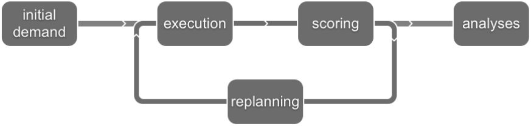

# Basic Info

## Introduction

* Microscopic modeling of traffic: MATSim performs integral microscopic simulation of resulting traffic flows and the congestion they produce.
* Microscopic behavioral modeling of demand/agent-based modeling: MATSim uses a microscopic description of demand by tracing the daily schedule and the synthetic travelers’ decisions.  In retrospect, this can be called “agent-based”.
* Computational physics: MATSim performs fast microscopic simulations with 10^7 or more “particles”.
* Complex adaptive systems/co-evolutionary algorithms: MATSim optimizes the experienced utilities of the whole schedule through the co-evolutionary search for the resulting equilibrium or steady state.

## Simulation Stages

* Initial demand - describes mobility behaviour (list of agents and their plans)
* Execution - “mobsim”, agents and vehicles are moved around in the network&#x20;
* Scoring - after execution of the plans end, the plans are evaluated based on the execution
* Replanning - performed by “strategy modules”
* Analysis - at the end of complete simulation, performed automatically or separate post-process

## Terminology

Please, refer to [MATSim docs](https://www.matsim.org/docs/userguide/terminology)

### Agent-Based Transport Simulation 

* **Agent**: A synthetic person, part of a synthetic population.
* **Plan**: the intention of an agent, typically for one day."going to work at 07:30, go shopping on the way home at 17:00, be home at 17:45".Each agent needs at least one plan.
* **Choice set**: “plan set” of an agent
* **Choice set generation**: time mutation/re-route/...; innovation of existing plans
* **Choice**: replanning - random replanning strategy
* **Convergence**: learning rate
* **Score**: utility of a plan after it was simulated.
* **Scenario, Model**: several datasets and parameters describing infrastructure (supply) and demand in a region. "Scenario" and "model" are often used without differentiation in MATSim's context.

### MATSim Loop

* **Scenario data**: description of infrastructure (road network, transit schedule, ...) and agents.
* **Execution**: Agents' travel plans are executed in parallel.A.k.a.: mobsim (mobility simulation), synthetic reality, network loading, traffic flow simulation
* **Scoring**: each executed plan obtains a score.
* **Replanning**: some agents change plans or create new ones.
* **Analyses**: traffic volumes, average speeds, utility changes, emissions, accessibility, …
* **Iterations**: execution, scoring and replanning are iteratively performed.
* **Optimization**: each agent tries to optimize its day.
* **Evolutionary algorithm**: each agent has a set of plans ("choice set"), adding new plans(replanning), removing bad ones after a while.
* **Co-Evolutionary algorithm**: If a plan performs good or bad also depends on the plans of all the other agents.
* **Nash-Equilibrium**: Each agent tries to optimize its plan egotistically. (≠ system optimum)

### Other

* **Plans** (input) vs. **events** (output)
* **Legs** vs. **Trips**
  * Plan contains “activity” (e. g. working) and “legs” (going to work by car)
  * Trips - moving from one node to another with a 0 duration activity
