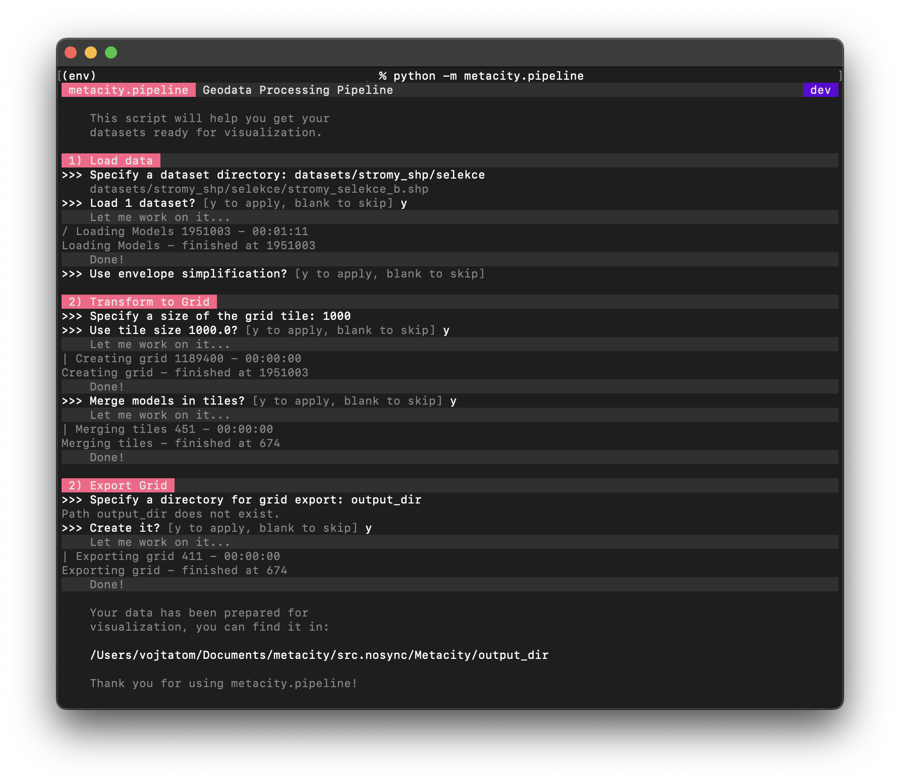

# 🌆 Metacity

The `Metacity` package allows to preprocess geospatial data and export it in a more suitable form for web visualization.&#x20;

### Installation

The package relies on system packages [`GDAL`](https://gdal.org) and [`CMake`](https://cmake.org). Please make sure they are installed before trying to install the `Metacity` package.

1. Install [GDAL](https://mothergeo-py.readthedocs.io/en/latest/development/how-to/gdal-ubuntu-pkg.html)

```bash
sudo add-apt-repository ppa:ubuntugis/ppa
sudo apt-get update
sudo apt-get install gdal-bin
```

1. Install [CMake](https://cmake.org/download/)

```bash
sudo apt-get install cmake
```

* If you don't want to edit the `Metacity` code,
* and if you have [`GDAL`](https://gdal.org) and [`CMake`](https://cmake.org) installed on your system,

you can install `Metacity` with [pip](https://pypi.org/project/metacity/):

```bash
pip install metacity
```

### How to compile locally

Metacity is written in Python and C++ using [`pybind11`](https://github.com/pybind/pybind11). If you want to edit the package code yourself, we recommend following these steps first:&#x20;

Clone the repository:

```bash
git clone git@github.com:MetacitySuite/Metacity.git
```

(Optional) Initialize local Python virtual environment

```bash
cd Metacity
python -m venv env
. ./env/bin/activate
```

Inside `Metacity` directory initialize `pybind11` submodule:

```bash
git submodule update --init --recursive
```

Install requirements:

```bash
pip install -r requirements.txt
```

Any time you make change to the C++ code, you can build it with:

```bash
python setup.py build_ext --inplace
```

### Debugging

If you encounter any problems, ensure you:

* have `GDAL` and `CMake` installed
* installed packages based on `requirements.txt`
* have a C++ compiler supporting C++17 installed

## Usage

The Python package`metacity` acts as the entry data gateway. The easiest way to understand `Metacity` is to think of it as a _pipeline_. To prepare your data for visualization, you will need to:

1. [Import your data](metacity.md#data-import)
2. [Create new Layer(s)](metacity.md#layers)
3. Optionally optimize and modify the data ([Height mapping](metacity.md#height-mapping), etc.)
4. Convert Layers selected for visualization to [Grid](metacity.md#grids)&#x20;
5. Optionally optimize the Grid data ([Model merging](metacity.md#merging), etc.)
6. [Export tiled](metacity.md#undefined) data for streaming

### Structure

`Metacity` consists of several sub-packages:

* `metacity.io` - importing and exporting data
* `metacity.geometry` - geometry processing
* `metacity.utils` - managing file systems and inspecting data
* (in `dev` only) `metacity.pipeline` with a CLI tool for data processing

### Processing CLI

Do you have just a couple of files you want to convert for visualization in BananaGL? Then the&#x20;

```bash
python -m metacity.pipeline
```

utility is right for you! (Note that this feature is currently in development and accessible on the `dev` branch -[ local compilation required](metacity.md#how-to-compile-locally).)



## Data Import

Metacity currently supports the following formats:

| Format    | Suffix  | Reference                                                                                                                                             |
| --------- | ------- | ----------------------------------------------------------------------------------------------------------------------------------------------------- |
| Shapefile | `.shp`  | [ESRI Shapefile Technical Description](https://www.esri.com/content/dam/esrisites/sitecore-archive/Files/Pdfs/library/whitepapers/pdfs/shapefile.pdf) |
| GeoJSON   | `.json` | [The GeoJSON Specification (RFC 7946)](https://geojson.org)                                                                                           |

Importing data is fairly easy with the functionalities provided by the `metacity.io` module:

### Importing a single file

<pre class="language-python"><code class="lang-python">from metacity.io import parse
<strong>#parse(file: str, from_crs: str = None, to_crs: str = None) -> List[Models]
</strong>models = parse("data/file.shp", from_crs="EPSG:4326", to_crs="EPSG:5514")</code></pre>

The `parse` function loads contents of a provided file and optionally transforms it from one coordinate reference system to another. It returns a list of `Models`.

### Importing multiple files

Often, the geospatial data is partitioned into several files and scattered among several directories. If you wish to import all of the data located in the directory tree under a certain folder, you can do:

<pre class="language-python"><code class="lang-python">from metacity.io import parse_recursively
<strong>#parse_recursively(dir: str, from_crs: str = None, to_crs: str = None) -> List[Models]
</strong>models = parse_recursively("data", from_crs="EPSG:4326", to_crs="EPSG:5514")</code></pre>

The returned value is a flattened list of `Models` regardless of how many files were processed.

## Models

A `Model` is a universal entity for storing geometry and metadata, it has no specific semantic meaning.&#x20;

* The geometry is stored in `Attributes`. Models can have multiple `Attributes` - see section [Attributes](metacity.md#attributes).
* The properties can be attached to a model as a metadata

See the following example:

<pre class="language-python"><code class="lang-python">from metacity.geometry import Model, Attribute

model = Model()
position_attr = Attribute()
position_attr.push_polygon3D([[0, 0, 0, \
                               0, 0, 1, \
                               0, 1, 1]])
                          
<strong>#Model.add_attribute(self, attr_name: str, attr: Attribute) -> None
</strong>model.add_attribute("POSITION", position_attr)

<strong>#Model.set_metadata(self, metadata: dict) -> None
</strong>model.set_metadata({ "description": "An example triangle" })</code></pre>

Additionally, the `Model` class has the following methods:

<pre class="language-python"><code class="lang-python">#Complementary to method add_attribute, there is also 
<strong>#Model.attribute_exists(self, attr_name: str) -> bool
</strong>assert model.attribute_exists("POSITION") == True

<strong>#Model.get_attribute(self, attr_name: str) -> Attribute
</strong>position_attr = model.get_attribute("POSITION")</code></pre>

Note that the property `Model.metadata` returns a copy. Updating it won't affect the metadata stored inside the model. If you wish to update the metadata, use the `Model.set_metadata` method:

<pre class="language-python"><code class="lang-python"><strong>#@property
</strong><strong>#Model.metadata(self) -> dict
</strong>model.metadata["description"] = "A new description"
assert model.metadata["description"] != "A new description"

#updating the metadata
<strong>#Model.set_metadata(self, metadata: dict) -> None
</strong>model.set_metadata({ "description": "A new description" })
assert model.metadata["description"] == "A new description"</code></pre>

It is possible to check what is the geometry type of the `Model`. Note that models do not support mixing geometry types. If you need this feature, consider splitting your geometry into several `Models`.&#x20;

<pre class="language-python"><code class="lang-python"><strong>#@property
</strong><strong>#Model.geom_type(self) -> int
</strong>geometry_type_code = model.geom_type</code></pre>

For the encoding explanation, see Attribute [Geometry Type](metacity.md#type). The `geom_type` property of the `Model` class always returns the type of the `POSITION` attribute.&#x20;

### Attributes&#x20;

`Attributes` work similarly to [GLTF buffers](https://www.khronos.org/files/gltf20-reference-guide.pdf). The `Attribute` API allows parsing of various data. All data is stored inside as if it was 3D data (2D data gets padded by zeroes).&#x20;

A unique name identifies each attribute. There are a few names that are commonly used for certain types of attributes:

| Name       | Description                         |
| ---------- | ----------------------------------- |
| `POSITION` | coordinates of the vertex positions |
| `NORMAL`   | normal buffer                       |
| `COLOR`    | vertex color                        |

`Metacity` does not utilize indices for geometry reuse, all data is stored "as is" in sequential order.

If everything works as intended, a user **should rarely work directly with** `Attributes`. Occasionally, it might be useful to be able to access the Attribute API:

<pre class="language-python"><code class="lang-python">from metacity.geometry import Attribute

points = Attribute()
#Insert 2D points using push_line2D method:
<strong>#Attribute.push_point2D(self, points: List[float]) -> None
</strong>points.push_point2D([0, 0, \
                    1, 1, \
                    1, 2])
#Similar for 3D points
<strong>#Attribute.push_point3D(self, points: List[float]) -> None
</strong>points.push_point3D([0, 0, 0,   \
                     1, 1, 0.5, \
                     1, 2, 1])
                     
<strong>#@property
</strong><strong>#Attribute.geom_type(self) -> int:
</strong>assert points.geom_type == 1</code></pre>

Parsing Lines is very similar to parsing points, although the main difference is the data gets stored as individual segments duplicating inner vertices.  &#x20;

<pre class="language-python"><code class="lang-python">from metacity.geometry import Attribute

lines = Attribute()
#Insert 2D line string using push_line2D method:
<strong>#Attribute.push_line2D(self, line: List[float]) -> None
</strong>lines.push_line2D([0, 0, \
                    1, 1, \
                    1, 2])
#in the example above, the vertices get internally stored as:
#input:          a - b - c
#stored values: [0, 0, 0, 1, 1, 0, 1, 1, 0, 1, 2, 0]
#               [a - b, b - c]
#               every 3rd zero is padding for 3D data, inner vertex si duplicated 

#Similar for 3D points
<strong>#Attribute.push_line3D(self, line: List[float]) -> None
</strong>lines.push_line3D([0, 0, 0,   \
                    1, 1, 0.5, \
                    1, 2, 1])
                    
<strong>#@property
</strong><strong>#Attribute.geom_type(self) -> int:
</strong>assert lines.geom_type == 2</code></pre>

Polygons are automatically triangulated, the API also supports polygons with holes:

<pre class="language-python"><code class="lang-python">from metacity.geometry import Attribute

triangles = Attribute()
#Insert simple 2D polygon using push_polygon3D method:
<strong>#Attribute.push_polygon2D(self, polygon: List[List[float]]) -> None
</strong>triangles.push_polygon2D([[0, 0, \
                          0, 1, \
                          1, 1, \
                          0, 1]])
                          
#The structure draws from GeoJSON specs,
#the List[List[float]] can be interpreted as [[polygon], [hole], [hole] ...] 
#Insert 2D polygon with a hole in the middle:
triangles.push_polygon2D([[0, 0, \
                          0, 1, \
                          1, 1, \
                          0, 1],\
                          [0.25, 0.25, \
                           0.25, 0.75, \
                           0.75, 0.75, \
                           0.75, 0.25])

#All works equivalently for 3D:
<strong>#Attribute.push_polygon3D(self, polygon: List[List[float]]) -> None    
</strong>triangles.push_polygon3D([[0, 0, 1, \
                          0, 1, 1, \
                          1, 1, 1, \
                          0, 1, 1]])     
                          
<strong>#@property
</strong><strong>#Attribute.geom_type(self) -> int:
</strong>assert triangles.geom_type == 3                  </code></pre>

### Geometry Type

Notice the `geom_type` property:

<pre class="language-python"><code class="lang-python">from metacity.geometry import Attribute
attribute = Attribute()
#...
<strong>#@property
</strong><strong>#Attribute.geom_type(self) -> int:
</strong>assert attribute.geom_type == 0 #No geometry
assert attribute.geom_type == 1 #Points
assert attribute.geom_type == 2 #Lines
assert attribute.geom_type == 3 #Triangles</code></pre>

### Attribute Caveats

As demonstrated above, `Attributes` can handle loading various types of data. What you should never do is _mix_ those types of data:

```python
#!!!NEVER DO THIS!!!
from metacity.geometry import Attribute
points = Attribute()
points.push_point2D([0, 0, 1, 1, 1, 2])
points.push_line2D([0, 0, 1, 1, 1, 2]) #<- will raise exception
```

What you can do is mix 2D and 3D data since 2D gets internally padded by zeroes:

```python
from metacity.geometry import Attribute
points = Attribute()
points.push_point2D([0, 0, 1, 1, 1, 2])
points.push_point3D([0, 0, 0, 1, 1, 0, 1, 2, 0]) #<- is allowed
```


Internally, `Attribute` keeps track of the first assigned type (points, lines, or polygons) and checks all future assignments against it. If the type does not match, an exception gets raised.


## Layers

Sometimes, it is handy to organize things into groups. In Metacity, you can use `Layers`.

<pre class="language-python"><code class="lang-python">from metacity.geometry import Layer, Model
layer = Layer()

models = [Model(), Model()]
<strong>#Layer.add_models(self, models: List[Model]) -> None
</strong>layer.add_models(models)</code></pre>

It is also possible to add a single model:

<pre class="language-python"><code class="lang-python">from metacity.geometry import Layer, Model
layer = Layer()

model = Model()
<strong>#Layer.add_model(self, model: Model) -> None
</strong>layer.add_model(model)</code></pre>

You can access the individual models again. Deleting a `Model` from the returned list does not remove it from the `Layer`.  The models are not copied, the returned list contains references to the models stored inside Layer.

<pre class="language-python"><code class="lang-python">from metacity.geometry import Layer
layer = Layer()
#... loading data, processing it

<strong>#Layer.get_models(self) -> List[Model]
</strong>models = layer.get_models()</code></pre>

Moreover, it is possible to store and load the contents of a `Layer` to and from the `.gltf` format.&#x20;

<pre class="language-python"><code class="lang-python">from metacity.geometry import Layer
layer = Layer()
#... loading data, processing it

<strong>#Store the data
</strong><strong>#Layer.to_gltf(filename: str) -> None
</strong>layer.to_gltf("layer.gltf")

<strong>#Load the data
</strong><strong>#Layer.from_gltf(filename: str) -> None
</strong>layer_copy = Layer()
layer_copy.from_gltf("layer.gltf")</code></pre>

`Layer` offers a few handy methods which can modify models:

### Height Mapping

If you have 2D point data in one `Layer` and a mesh with the height information (such as terrain) in a different one, you can easily map the original 2D data onto the terrain:

<pre class="language-python"><code class="lang-python">from metacity.geometry import Layer
from metacity.io import parse_recursively

terrain = Layer()
terrain.add_models(parse_recursively("terrain"))

trees = Layer()
trees.add_models(parse_recursively("trees"))

<strong>#Layer.map_to_height(self, layer: Layer) -> None
</strong>trees.map_to_height(terrain)</code></pre>

### Simplification

In case you need to simplify your geometry by approximating it with its crude envelope (not a perfect convex hull), you can use the following method:

<pre class="language-python"><code class="lang-python">from metacity.geometry import Layer
from metacity.io import parse_recursively

buildings = Layer()
buildings.add_models(parse_recursively("buildings"))

<strong>#Layer.simplify_envelope(self) -> None
</strong>buildings.simplify_envelope()</code></pre>

### Height Map Re-mesh

It is possible to re-mesh a model using a height-map approach. A grid of vertices is generated and placed "on top" of the source model, effectively covering it.&#x20;

The new mesh is divided into several tiles (each is a separate `Model`), and each tile is further divided according to the supplied parameters:


<pre class="language-python"><code class="lang-python">from metacity.geometry import Layer
from metacity.io import parse_recursively

terrain = Layer()
terrain.add_models(parse_recursively("terrain"))

<strong>#Layer.simplify_remesh_height(self, tile_side: float, tile_divisions: int) -> None
</strong>terrain.simplify_remesh_height(100, 4)</code></pre>

## Grids

Working with large datasets locally might be fine but for streaming it is necessary to tile the data into individual tiles and load only what's in the viewport.

<pre class="language-python"><code class="lang-python">from metacity.geometry import Layer, Grid, Model
from metacity.io import parse_recursively

terrain = Layer()
terrain.add_models(parse_recursively("terrain"))

<strong>#Grid(self, tile_width: float, tile_height: float) -> Grid
</strong>grid = Grid(1000, 1000)
<strong>#Grid.add_layer(self, layer: Layer) -> None
</strong>grid.add_layer(terrain)
<strong>#Grid.add_model(self, arg0: Model) -> None
</strong>grid.add_model(Model())</code></pre>

### Exporting data

This is the final step of getting the data ready for visualization. Exporting data from the grid prepares several files for streaming:

<pre class="language-python"><code class="lang-python">from metacity.utils.filesystem import recreate_dir

<strong>#recreate_dir(dir: str) -> None
</strong>recreate_dir("terrain_grid_export")
<strong>#Grid.to_gltf(self, dir: str) -> None
</strong>grid.to_gltf("terrain_grid_export")</code></pre>

The first `recreate_dir` empties the specified directory and  `Grid.to_gltf` then fills it with individual tiles and a `layout.json:`

```
terrain_grid_export
├── layout.json
├── tile123_456.glb
...
└── tile678_879.glb 
```

* The individual tiles are `.glb` files named `tilex_y.glb` where `x` and `y` are replaced by the respective tile coordinates.
* In the two examples above, the grid is tiled into tiles with the dimensions 1000 by 1000 units
* The `layout.json` file contains the mapping of the tiles to the real coordinates

The `layout.json` example:

```json5
{
    "tileHeight": 1000.0,
    "tileWidth": 1000.0,
    "tiles": [
        { //start tile
            "file": "tile-731_-1036.glb", //name of the file
            "size": 174, //number of objects inside a tile
            "x": -731, //tile x-coordinate, 
                       //to get a real coordinate, multiply by tileWidth
            "y": -1036 //tile y-coordinate
                       //to get a real coordinate, multiply by tileHeight
        }, //end tile
        ... //more tiles
    ]
}
```

### Merging&#x20;

Sometimes, a single tile contains a lot of models, but you don't need to distinguish between them; you only care about getting everything rendered quickly. It is advisable to _merge_ all models in individual tiles into one model per tile.


Remember the [`Attribute` type mixing rules](metacity.md#attribute-caveats)? Similar rules apply here:

* All models must contain identically named `Attributes`
* All `Attributes` with corresponding names across models must be of the same type


<pre class="language-python"><code class="lang-python">from metacity.geometry import Layer, Grid, Model
from metacity.io import parse_recursively

terrain = Layer()
terrain.add_models(parse_recursively("terrain"))
grid = Grid(1000, 1000)
grid.add_layer(terrain)
<strong>#Grid.tile_merge(self) -> None
</strong>grid.tile_merge()</code></pre>

Now, each tile inside `grid` contains only a single model.&#x20;

## DevOps&#x20;

After uploading any code to the [Metacity GitHub repo](https://github.com/MetacitySuite/Metacity), the actions specified in [`ci.yml`](https://github.com/MetacitySuite/Metacity/blob/main/.github/workflows/ci.yml) are executed. Generally, it involves&#x20;

1. Building the C++ parts of the code
2. Running tests with `pytest` - see [Testing](metacity.md#tests)

Additional actions can be triggered using the [Pull Request Flags](metacity.md#pull-request-flags).

### Testing

`Metacity` comes with a few testing datasets and uses [`pytest`](https://docs.pytest.org/en/7.1.x/). To run the tests locally, with coverage analysis, run:

```bash
python -m pytest tests/* --cov=metacity --cov-report term-missing
```

If you need to see the output of the tested code, run the command above with an extra flag `-s`

The tests are located inside the `tests` directory:

* `tests/conftest.py` contains [fixtures](https://docs.pytest.org/en/6.2.x/fixture.html) providing the testing data.
* `tests/test_module.py` contains individual tests, the `module` placeholder in the filename is usually replaced with the name of the tested Python module (not required)

Always test your code!

### Publishing

Before you publish a new version:

* you will need a password or a secret token (which can only be provided by [the cat](https://github.com/vojtatom))
* make sure the version number in `setup.py` is correct and not behind [the last published version](https://pypi.org/project/metacity/)

Note that it is possible to publish a new version by successfully merging a Pull Request from `dev` to `main` branch by adding `action::package` into the merge commit message - see [Pull Request Flags](metacity.md#pull-request-flags).

To publish the code from your local computer, run the following commands:

```
rm -rf dist;
rm -rf metacity.egg*;
python setup.py sdist; 
python -m twine upload dist/*;
```

The contents of the package are specified in `MANIFEST.in` located in the root of the repository.

### Branches

| Branch | Status                                                                                                                                                                                           | Description                                                           |
| ------ | ------------------------------------------------------------------------------------------------------------------------------------------------------------------------------------------------ | --------------------------------------------------------------------- |
| main   | [](https://github.com/MetacitySuite/Metacity/actions?query=workflow%3A%22Metacity+CI%22) | protected, merged PRs auto tested and deployed to PyPI if tag present |
| dev    | [](https://github.com/MetacitySuite/Metacity/actions?query=workflow%3A%22Metacity+CI%22)  | merged PRs auto tested and version bumped if tag present              |

### Pull Request Flags

Typing any of the following strings into the commit message while merging a pull request will trigger an action in the CI.

#### From `any branch` to `dev`

When merging from any branch to `dev` branch:

* `action::bump` - flag to run bump package version, the version is bumped as a patch if no version tag is used.
  * `version::patch` - bump version after patch/bug fix/minor change
  * `version::minor` - bump version after new feature/minor change
  * `version::major` - bump version after major change/breaking change

#### From `dev` to `main`

When merging from `dev` to `main` branch:

* `action::package` - flag to deploy to PyPI
